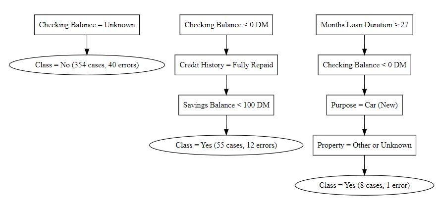
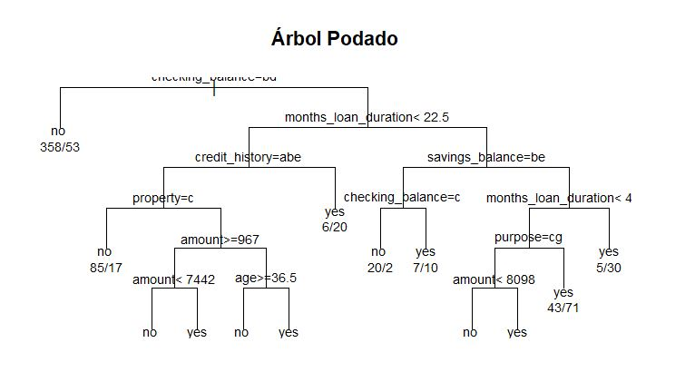
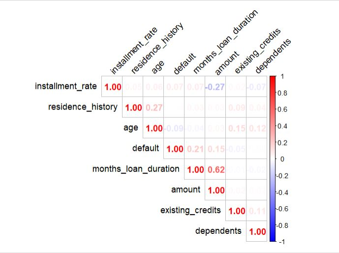
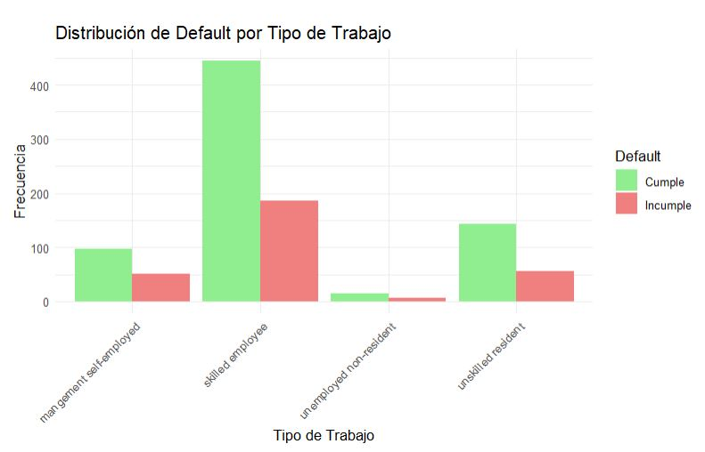

# 📊 Credit Risk Classification with Decision Trees, Random Forest, and SVM

This repository contains the **Datamanz project** for credit risk classification on the German Credit dataset.  
We compare **Decision Trees**, **Random Forest**, and **Support Vector Machines (SVM)**, reporting metrics such as accuracy, sensitivity, specificity, PPV, ROC/AUC, and variable importance.  

---

## ✨ Project Objectives
- 🔍 Perform **Exploratory Data Analysis (EDA)** to identify key patterns.  
- 🌳 Build and prune **Decision Trees** for interpretability.  
- 🌲 Apply **Random Forest** for ensemble learning.  
- 🤖 Train **Support Vector Machines (SVM)** for margin-based classification.  
- 📈 Evaluate models with **confusion matrices, metrics, and ROC curves**.  

---

## 📂 Repository Structure

```bash
├── data/                  # Dataset (German Credit)
├── scripts/               # Modular R scripts for each step
├── results/               # Outputs: confusion matrices, metrics, variable importance
├── docs/                  # Plots and images for README
│   ├── 1.JPG
│   ├── 2.JPG
│   ├── 3.JPG
│   └── 4.JPG
├── Datamanz_CreditRisk.Rmd
├── README.md
├── LICENSE
└── .gitignore

---

## 🖼️ Key Visuals

### 🔎 Exploratory Data Analysis
**Default Distribution by Job Type**  


**Correlation Matrix**  


---

### 🌳 Decision Tree
**Pruned Tree**  


**Extracted Rules**  


---

## 📊 Model Results

- 🌳 **Decision Tree**  
  - Accuracy: 67%  
  - Sensitivity: 45.45%  
  - Specificity: 80%  

- 🌲 **Random Forest (base)**  
  - Accuracy: 74%  
  - Sensitivity: 59.09%  
  - Specificity: 91.04%  

- ⚙️ **Random Forest (caret)**  
  - Accuracy: 71%  
  - Sensitivity: 86.57%  
  - Specificity: 39.39%  

- 🤖 **SVM**  
  - Accuracy: 74%  
  - Sensitivity: 89.55%  
  - Specificity: 42.42%  

---

## 📝 Conclusions
- ✅ **Random Forest (caret):** best sensitivity → useful when detecting defaulters is the priority.  
- ✅ **Base Random Forest:** better balance between accuracy and specificity → reliable in practice.  
- ❌ **Decision Tree:** interpretable but lower performance.  
- ⚖️ **SVM:** good overall accuracy but low specificity, limiting its usefulness for credit risk detection.  

---

## 📌 Reference
Full analysis published on **RPubs** 👉 [Credit Risk Report](https://rpubs.com/Datamanz/CreditRisk)  

---

## ⚖️ License
MIT License © 2025 — Datamanz
